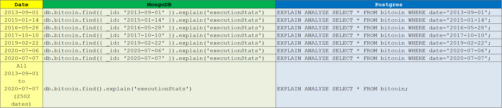
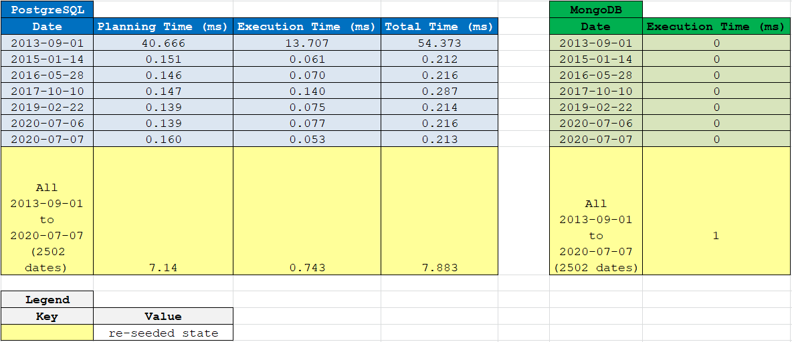

# bitcoin-price-index

## Table of Contents

1. [About](#about)
    - [Main Development Dependencies](#main-development-dependencies)
    - [Technologies](#technologies)
    - [Client](#client)
    - [Database](#database)
    - [Server](#server)
    - [Logger](#logger)
2. [Getting Started](#getting-started)
    1. [Development Mode](#1-development-mode)
        1. [Install dependencies and development dependencies](#11-install-dependencies-and-development-dependencies)
        2. [Populate PostgreSQL database](#12-populate-postgresql-database)
        3. [Start webpack](#13-start-webpack)
        4. [Open a new terminal](#14-open-a-new-terminal)
        5. [Start Express.js server](#15-start-expressjs-server)
        6. [Now visit _http://localhost:3000/_ to see the React application](#16-now-visit-httplocalhost3000-to-see-the-react-application)
    2. [Production Mode](#2-production-mode)
        1. [Configure Environment Variables _.env_ File](#21-configure-environment-variables-env-file)
        2. [Install dependencies and development dependencies](#22-install-dependencies-and-development-dependencies)
        3. [Populate PostgreSQL database](#23-populate-postgresql-database)
        4. [Start webpack](#24-start-webpack)
        5. [Start Express.js server](#25-start-expressjs-server)
3. [System Design](#system-design)
    1. [Database - PostgreSQL vs MongoDB](#1-development-mode)
        1. [Seed](#11-seed)
        2. [Schema](#12-schema)
        3. [Search Queries](#13-search-queries)
        4. [Execution Times](#14-execution-times)
        5. [Decision](#15-decision)
        6. [Reason](#16-reason)

---

## About

### Main Development Dependencies

| DevDependency | Version |
| ------------- | :-----: |
| @babel        | 7       |
| react         | 16      |
| webpack       | 4       |

### Technologies

- ReactJS
- NodeJS
- ExpressJS
- JavaScript
- MongoDB
- PostgreSQL

### Client

- ReactJS
- ChartJS

### Database

1. Type
    - Structured Query Language (SQL)
2. Relational Database Management System (RDMS)
    - PostgreSQL
        1. Database Name
            - cryptocurrency
        2. Table Name
            - bitcoin
        3. Fields
            - date
            - price

### Server

- NodeJS
- ExpressJS
- JavaScript

### Logger

- Winston logger
- Winston Daily Rotate File transport

---

## Getting Started

### 1. Development Mode

#### &ensp;&ensp;&ensp;&ensp;1.1. Install dependencies and development dependencies

```sh
        npm install
```

&ensp;&ensp;&ensp;&ensp;&ensp;&ensp;&ensp;&ensp;&ensp;&ensp;&ensp;&ensp;&ensp;&ensp;&ensp;&#8226; ___./node_modules/_ directory is now added and _./package-lock.json_ is now compiled__.

```text
                    .
                    ├── node_modules
                    └── package-lock.json
```

#### &ensp;&ensp;&ensp;&ensp;1.2. Populate PostgreSQL database

```sh
        npm run db:seed
```

&ensp;&ensp;&ensp;&ensp;&ensp;&ensp;&ensp;&ensp;&ensp;&ensp;&ensp;&ensp;&ensp;&ensp;&ensp;&#8226; ___./logger/log/_ directory of daily log files (date file format: _YYYY-MM-DD_.log) is now created__.

```text
                    .
                    └── logger
                        └── log
                            └── YYYY-MM-DD.log
```

#### &ensp;&ensp;&ensp;&ensp;1.3. Start webpack

```sh
        npm run react-dev
```

&ensp;&ensp;&ensp;&ensp;&ensp;&ensp;&ensp;&ensp;&ensp;&ensp;&ensp;&ensp;&ensp;&ensp;&ensp;&#8226; ___./client/dist/bundle.js_ is now compiled__.

```text
                    .
                    └── client
                        └── dist
                            ├── index.html
                            └── bundle.js
```

#### &ensp;&ensp;&ensp;&ensp;1.4. Open a new terminal

#### &ensp;&ensp;&ensp;&ensp;1.5. Start Express.js server

```sh
        npm run server-dev
```

#### &ensp;&ensp;&ensp;&ensp;1.6. Now visit _[http://localhost:3000/](http://localhost:3000/)_ to see the React application

### 2. Production Mode

#### &ensp;&ensp;&ensp;&ensp;2.1. Configure Environment Variables _.env_ File

| Variable                | Default Value  | Description              |
| ----------------------- | -------------- | ------------------------ |
| DB_HOST                 | localhost      | PostgreSQL host          |
| DB_PORT                 | 5432           | PostgreSQL port          |
| ___DB_NAME___           | cryptocurrency | PostgreSQL database name |
| DB_USER                 | postgres       | PostgreSQL username      |
| DB_PASS                 | ''             | PostgreSQL password      |
| MONGODB_HOST            | 127.0.0.1      | MongoDB host             |
| MONGODB_PORT            | 27017          | MongoDB port             |
| MONGODB_DB_NAME         | cryptocurrency | MongoDB database name    |
| MONGODB_COLLECTION_NAME | bitcoin        | MongoDB collection name  |
| APP_SERVER_PORT         | 3000           | Application server port  |
| BABEL_ENV               | development    | Babel environment        |
| NODE_ENV                | development    | Node environment         |

&ensp;&ensp;&ensp;&ensp;&ensp;&ensp;&ensp;&ensp;___***NOTE___: re-assigning ___DB_NAME___ requires an edit to _./database/schema.sql_

#### &ensp;&ensp;&ensp;&ensp;2.2. Install dependencies and development dependencies

```sh
        npm install
```

&ensp;&ensp;&ensp;&ensp;&ensp;&ensp;&ensp;&ensp;&ensp;&ensp;&ensp;&ensp;&ensp;&ensp;&ensp;&#8226; ___./node_modules/_ directory is now added and _./package-lock.json_ is now compiled__.

```text
                    .
                    ├── node_modules
                    └── package-lock.json
```

#### &ensp;&ensp;&ensp;&ensp;2.3. Populate PostgreSQL database

```sh
        npm run db:seed
```

&ensp;&ensp;&ensp;&ensp;&ensp;&ensp;&ensp;&ensp;&ensp;&ensp;&ensp;&ensp;&ensp;&ensp;&ensp;&#8226; ___./logger/log/_ directory of daily log files (date file format: _YYYY-MM-DD_.log) is now created__.

```text
                    .
                    └── logger
                        └── log
                            └── YYYY-MM-DD.log
```

#### &ensp;&ensp;&ensp;&ensp;2.4. Start webpack

```sh
        npm run react-prod
```

&ensp;&ensp;&ensp;&ensp;&ensp;&ensp;&ensp;&ensp;&ensp;&ensp;&ensp;&ensp;&ensp;&ensp;&ensp;&#8226; ___./client/dist/bundle.js_ is now compiled__.

```text
                    .
                    └── client
                        └── dist
                            ├── index.html
                            └── bundle.js
```

#### &ensp;&ensp;&ensp;&ensp;2.5. Start Express.js server

```sh
        npm run server-prod
```

---

## System Design

### 1. Database - PostgreSQL vs MongoDB

#### &ensp;&ensp;&ensp;&ensp;1.1 Seed

##### &ensp;&ensp;&ensp;&ensp;&ensp;&ensp;&ensp;&ensp;i. PostgreSQL and Sequelize Seed

```sh
          npm run db:seed
```

##### &ensp;&ensp;&ensp;&ensp;&ensp;&ensp;&ensp;&ensp;ii. MongoDB and Mongoose Seed

```sh
          npm run nosql:seed
```

#### &ensp;&ensp;&ensp;&ensp;1.2. Schema

##### &ensp;&ensp;&ensp;&ensp;&ensp;&ensp;&ensp;&ensp;i. PostgreSQL Schema

```sql
          CREATE TABLE bitcoin (
            date Date PRIMARY KEY,
            price Decimal NOT NULL
          );
```

##### &ensp;&ensp;&ensp;&ensp;&ensp;&ensp;&ensp;&ensp;ii. Mongoose Schema

```javascript
          const mongoose = require('mongoose');

          const { Schema } = mongoose;

          const bitcoinSchema = new Schema({
            _id: {
              type: String,
              minlength: 10,
              maxlength: 10,
              match: /^\d{4}-\d{2}-\d{2}/,
            },
            price: {
              type: Number,
              required: true,
              min: 0,
            },
          });
```

#### &ensp;&ensp;&ensp;&ensp;1.3. Search Queries



#### &ensp;&ensp;&ensp;&ensp;1.4. Execution Times



#### &ensp;&ensp;&ensp;&ensp;1.5. Decision

&ensp;&ensp;&ensp;&ensp;&ensp;&ensp;&ensp;&ensp;&#8226; PostgreSQL

#### &ensp;&ensp;&ensp;&ensp;1.6. Reason

&ensp;&ensp;&ensp;&ensp;&ensp;&ensp;&ensp;&ensp;&#8226; Faster search query execution time to read all bitcoin price indices.
